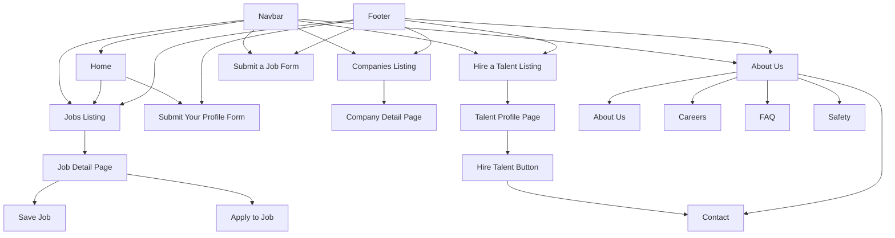
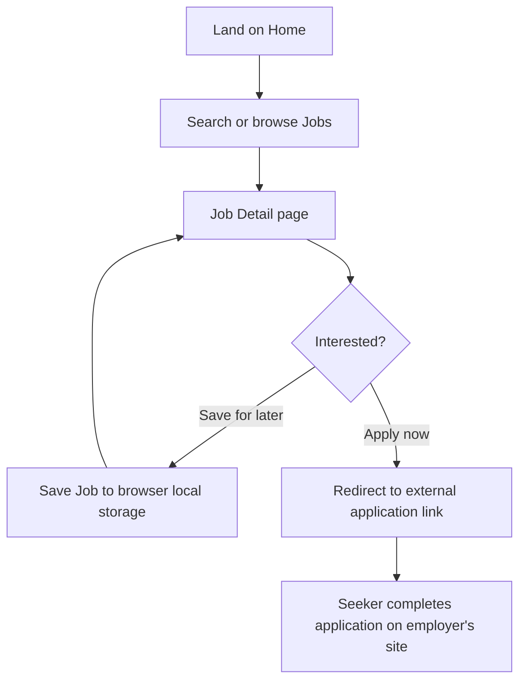
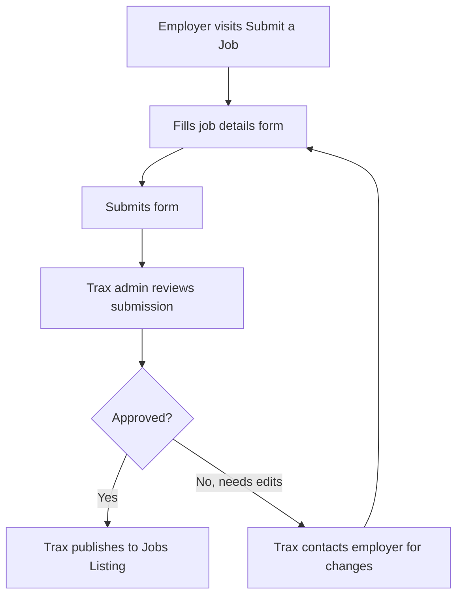
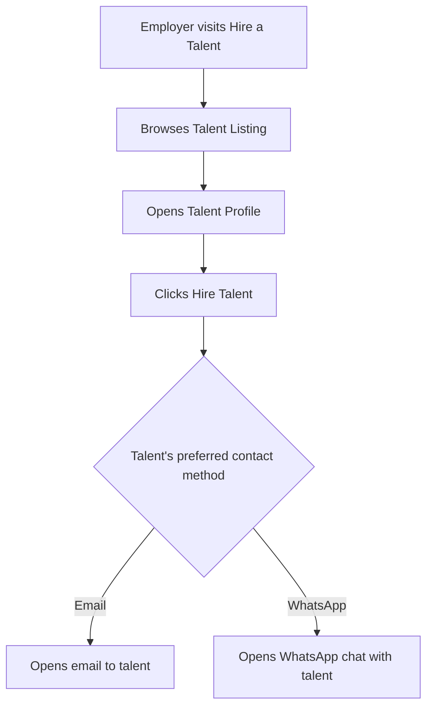
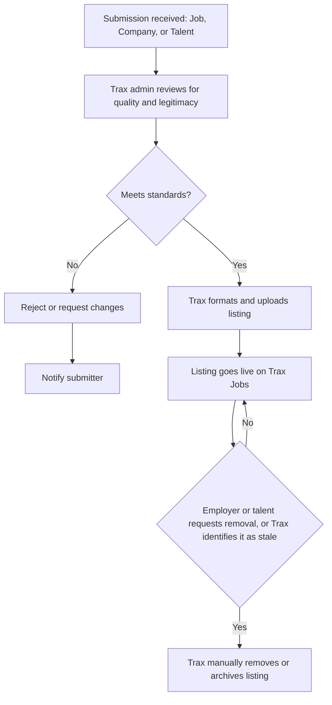
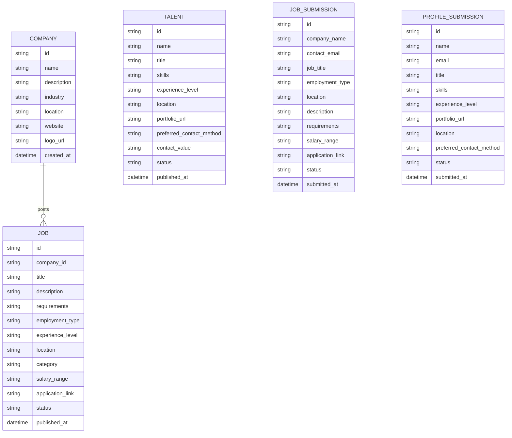

# Trax Jobs — Product Requirements Document

**Product:** Trax Jobs
**Parent brand:** Trax Media Ltd (trax.ng)
**Prepared for:** Ben Sam Oladoyin
**Status:** Draft v1
**Last updated:** August 30, 2026

---

## 1. Overview

Trax Jobs is a curated job board built on top of the Trax brand, a tech news and startup media platform rooted in Ogun State and covering the wider African tech ecosystem. Trax already covers startups, funding, people, ecosystem, and events across the continent. Trax Jobs extends that authority into employment, connecting job seekers, employers, and talent across Africa's tech ecosystem.

Trax Jobs is not a self serve marketplace. Trax manually reviews and publishes every job, company, and talent listing. There are no employer dashboards and no public sign up flows for posting content. This keeps quality high and matches how Trax already operates its Careers page today.

---

## 2. Goals and success metrics

**Primary goals**
- Become the trusted destination for tech jobs across Africa
- Give job seekers a curated, low noise alternative to generic job boards
- Give employers and hubs in the ecosystem a channel to reach vetted talent
- Extend Trax's existing editorial trust into a new product line

**Success metrics (early stage)**
- Number of live job listings
- Number of job seeker profile submissions
- Number of talent profiles published
- Number of companies listed
- Applications generated per job listing
- Newsletter to job board conversion (existing Trax briefing subscribers who engage with jobs)

---

## 3. User roles

| Role | Can do | Cannot do |
|---|---|---|
| Job seeker | Browse jobs, save jobs, apply to jobs, submit a profile | Post jobs directly, edit listings |
| Employer | Submit a job via form | Publish directly, manage listings, see applicant dashboard |
| Talent (freelancer / professional) | Submit a profile via form | Publish directly, edit own listing |
| Trax admin | Review, edit, publish, and remove all jobs, companies, and talent profiles | N/A |

There is no authentication or account system in this version. Submission review and publishing is handled internally by Trax. Auth and logic will be defined in a later phase.

---

## 4. Site map

---

## 5. Page specifications

### 5.1 Home

**Purpose:** Convert visitors into job seekers or submitters. Establish trust through Trax's existing brand authority.

**Sections, top to bottom:**
1. Navbar — Find Jobs, Hire a Talent, Companies, About Us, Submit a Job (button)
2. Hero — headline, subhead, search bar (role, skill, or company)
3. Explore opportunities that match your experience — experience level filter chips (Entry, Mid, Senior, Internship) plus a horizontal job card row, links into Jobs listing pre filtered
4. Everyone is learning these now — editorial content curated by Trax, showing hub names and the skills currently trending there. Static, no public links out, no submission flow
5. Level up your career — three to four value proposition cards
6. We are here for every step of your search — three step process block: Search, Apply, Grow
7. Why people trust us — trust signals (stats and or credibility statements)
8. CTA band — Submit Your Profile
9. Discover opportunity in your field — category grid linking into filtered Jobs listing
10. Footer

**States:** No empty state needed, this is a static marketing page. Job card rows should have a loading skeleton while data fetches.

---

### 5.2 Jobs

**Jobs Listing**
- Purpose: browse and filter all live job listings
- Page header: Find your next role across Africa's tech ecosystem
- Subhead: Every listing here has been reviewed by Trax. No recycled postings, no dead links, no noise.
- Search bar placeholder: Search by role, skill, or company
- Filters: Category, Experience Level, Location, Remote or On site
- Job card fields: role title, company name, location, employment type tag, posted date
- Empty state: "No roles match your filters right now. Try widening your search."
- Load more button label: Show more roles

**Job Detail**
- Purpose: give a seeker everything needed to decide whether to apply
- Header block: role title, company name and logo, location, employment type, posted date
- Section "About this role": intro line "Here is what the role actually involves," followed by the full description
- Section "What you will do": responsibilities list, pulled from the employer's submission
- Section "What you need": requirements list, pulled from the employer's submission
- Section "Compensation": shows salary range if provided, otherwise displays "Compensation not disclosed, ask during application"
- Sidebar: "About [Company Name]" with a short pulled description and a link to the full Company Detail page
- Buttons: Save, Apply now
- Save button microcopy on click: "Saved. Find it anytime under your saved roles."
- Trust line below the buttons: "Listed and reviewed by Trax."
- Apply action: redirects to an external application link supplied by the employer at submission
- Save action: adds to a saved list stored in browser local storage, no account required, saved jobs are per device

---

### 5.3 Companies

**Companies Listing**
- Purpose: browse companies active across Africa's tech ecosystem
- Page header: Companies shaping Africa's tech future
- Subhead: The employers already building the continent's tech industry.
- Filters: Industry, Location
- Company card fields: logo, name, industry, location, number of open roles
- Empty state: "No companies match your filters right now."

**Company Detail**
- Purpose: show company background and its current open roles
- Header block: company logo, name, industry, location, website link
- Section "About [Company Name]": pulled description
- Section "Open roles at [Company Name]": list of roles linking back to Job Detail
- Empty state for open roles: "No open roles right now. Check back soon."

---

### 5.4 Hire a Talent

**Talent Listing**
- Purpose: let employers browse vetted talent profiles
- Page header: Talent from across Africa, ready to work
- Subhead: Every profile here has been reviewed by Trax before it goes live.
- Filters: Skill, Experience Level, Location
- Talent card fields: name or role title, skill tags, experience level, location
- Empty state: "No talent matches your filters right now."

**Talent Profile**
- Purpose: give an employer enough detail to decide to reach out
- Header block: name or role title, skill tags, experience level, location
- Section "About": profile summary pulled from submission
- Section "Skills": full skill list
- Section "Portfolio": link, shown only if provided
- Button: Hire Talent
- Trust line below the button: "Reviewed and listed by Trax."
- Hire Talent action: presents a choice between email and WhatsApp, employer selects based on the talent's `preferred_contact_method`

---

### 5.5 About Us (tab group)

- **About Us** — Trax Jobs is the employment arm of Trax, the newsroom already tracking Africa's tech movement. Same standards, same ecosystem, now applied to hiring.
- **Careers** — Trax's own internal openings, reusing the existing Careers page pattern (role overview, what you will do, what we look for, apply CTA). Content pulled directly from the live Trax Careers page.
- **FAQ** — sample entries to seed the section:
  - How do listings get on Trax Jobs? Every job, company, and talent profile is reviewed by the Trax team before it goes live.
  - Can I post a job myself? Not directly. Submit your opening and Trax will review and publish it.
  - Is Trax Jobs free for job seekers? Yes, browsing and applying is free.
- **Safety** — guidance for job seekers: verify company details before sharing personal information, never pay to apply for a role, report any listing that feels off directly to Trax.
- **Contact** — general contact form: name, email, message. Intro line: "Have a question we have not answered yet? Reach out directly."

---

### 5.6 Submit a Job (form)

**Purpose:** collect job details from employers for Trax to review and publish
**Page header:** List your opening with Trax
**Subhead:** Reach vetted talent from across Africa's tech ecosystem. Every submission is reviewed before it goes live.
**Fields (draft):** company name, contact email, job title, employment type, location, description, requirements, salary range (optional), external application link (required, this is what the Apply button routes to)
**Submit button label:** Submit for review
**Post submit confirmation:** Received. Trax will review your listing and reach out if anything needs adjusting before it goes live.

---

### 5.7 Submit Your Profile (form)

**Purpose:** collect job seeker or talent details for Trax to review and optionally feature
**Page header:** Get on Trax's radar
**Subhead:** Whether you are job hunting or open to hire, this is how Africa's tech ecosystem finds you.
**Fields (draft):** name, email, role or title, skills, experience level, portfolio or CV link, location, preferred contact method (email or WhatsApp, used for the Hire Talent button)
**Submit button label:** Submit for review
**Post submit confirmation:** Received. Trax will review your profile and reach out if anything needs adjusting before it goes live.

---

## 6. User flows

### 6.1 Job seeker applies to a job

### 6.2 Employer submits a job

### 6.3 Employer hires talent

---

## 7. Admin workflow (intake to publish)

Since Trax manages all uploads, this is the most critical operational flow in the product.

---

## 8. Data model

---

## 9. Out of scope (this phase)

- User accounts and authentication for job seekers, employers, or talent
- Self serve posting or dashboards of any kind
- Public Hubs directory or hub registration flow
- Payment or paid listing tiers
- In app messaging between employers, applicants, or talent
- In site application capture (Apply routes externally, no applicant data stored by Trax)
- Automated listing expiry (all removals are manual)

---

## 10. Key decisions

- **Apply:** redirects to an external application link supplied by the employer at submission. Trax does not capture or store applications.
- **Save Job:** stored in browser local storage only, no account required, saved jobs are per device and not synced across devices.
- **Hire Talent:** talent selects a preferred contact method (email or WhatsApp) at submission. The Hire Talent button opens that channel directly.
- **Listing expiry:** no automated expiry. Trax removes or archives listings manually, either on request or when identified as stale.

---

*Prepared in Trax's editorial voice and structure, consistent with the existing trax.ng brand and Careers page pattern.*
